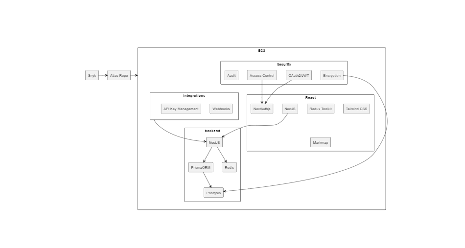

# Atlas Market Overview & Strategy

---

# Whiteboard Tools
### FigJam, Whiteboard, Miro, Lucid
- Good-to-excellent collaborative authoring use cases (ideation, kanban, etc)
- Some allow incoming/outgoing API calls
- Very competitive market, 20+ entrants, all consumer-accessible
- No meaningully structured output (single pdf, docx, etc)
- Highly mobile users - many will user 2-3 options
- Easy onboarding
- Bottom-up adoption

---

# Collaborative Notetaking
### OneNote, Obsidian, Word, TrilliumNext, Confluence
- Individual focused, often a personal choice
- Bad-to-Decent collaborative authoring
- Structure, hierarchical, and relational display are secondary use cases
- Structured output is limited to graph visualization & API (TrilliumNext & Obsidian)
- Highly fractured market
- Bottom-up adoption

---

# Project Management
### Jira, Trello, Asana, Notion
- Bad-to-Excellent authoring, visualization & reporting
- Heavy learning curve for structured output
- Low consumer accessibility
- Top-down adoption

---
# Technical/Academic/Scientific 
### VSCode, CurveNote, Corca, Overleaf
- Narrowly use-case driven
- Consumer-accessible
- Collaborator influenced
- Highly mobile
- Heavily fragmented

---
# Atlas UI Prototype

---

# Atlas Innovations & Use Cases

<!-- _class: cool-list -->
- **Structured Visualization & Output**
  - Proposal Generation
  - Project Planning
  - Learning Plans
  - Structured Ideation

  

    

- **User-extensible data model**
  - Object Tagging
  - 3D Graph visualization
  - Quantitiative Analysis
  - Budgeting
  - Reporting 

    

        

---
# Strategy

**Challenge**: Hypothesis is weakly supported & difficult to comprehensively test
**Approach**: Iterative, freemium SaaS to explore product-market fit

<!-- _class: cool-list -->
- **In development**
  - Minimal open source platform (<$0.60/user-mo)
  - Frictionless, free onboarding
  - Predictable user-extensible data model
  - Robust export (pdf, docx)
  - Broad editor support (Quill, LaTeX, UML)

  

    

- **Future**
  - Alternative renderers
  - Unstructured views
  - Reporting API
  - Ingest API

    

        

---

# Architecture

---
# Alternative Approaches
- Plugin:  build a plugin for existing whiteboard applications
  - Platform captivity
  - Opaque user patterns
  - Not much less expensive
  - Addressable via ingest API
