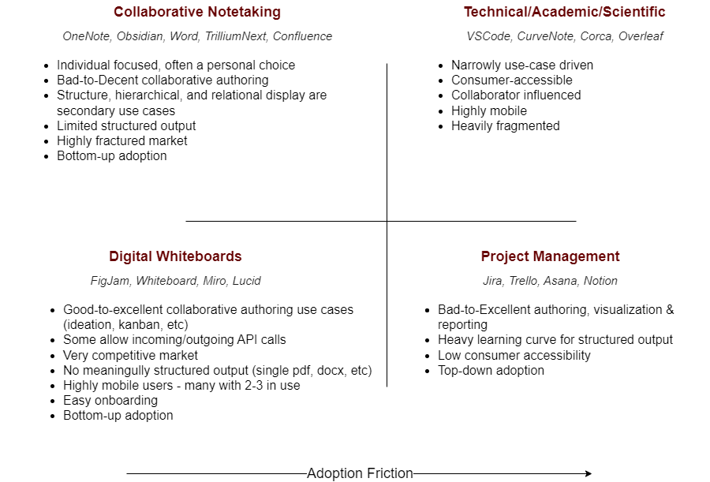
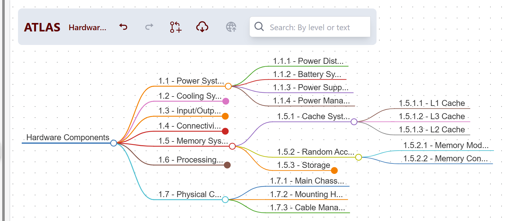
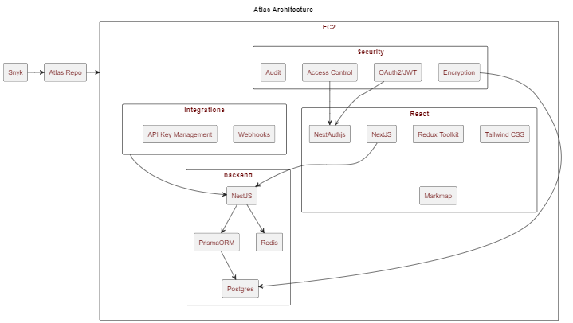

# Atlas Market Overview & Strategy

---
# Market Space

---

# Atlas UI Prototype
## https://dev.atlasflow.co

---

# Atlas Innovations & Use Cases

<!-- _class: cool-list -->
- **Structured Visualization & Output**
  - Proposal Generation
  - Project Planning
  - Learning Plans
  - Structured Ideation

  

    

- **User-extensible data model**
  - Object Tagging
  - 3D Graph visualization
  - Quantitiative Analysis
  - Budgeting
  - Reporting 

    

        

---
# Strategy

**Challenge**: Hypothesis is weakly supported & difficult to comprehensively test
**Approach**: Iterative, freemium SaaS to explore product-market fit

<!-- _class: cool-list -->
- **In development**
  - Minimal open source platform (<$0.60/user-mo)
  - Frictionless, free onboarding
  - Predictable user-extensible data model
  - Robust export (pdf, docx)
  - Broad editor support (Quill, LaTeX, UML)

  

    

- **Future**
  - Alternative renderers
  - Unstructured views
  - Reporting API
  - Ingest API

    

        

---

---
# Alternative Approaches
- Plugin:  build a plugin for existing platforms
  - Platform captivity
  - Opaque user patterns
  - Not much less expensive
  - Addressable via ingest API
