<!-- _class: lead --> 
# Atlas Market Overview & Strategy

---

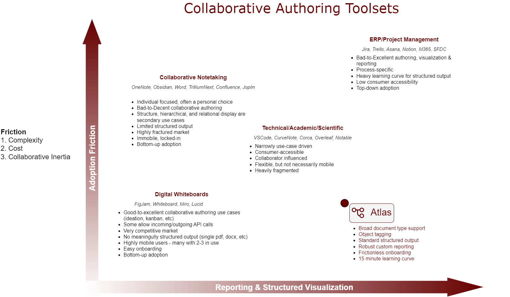

---

# Atlas Innovations & Use Cases

https://dev.atlasflow.co
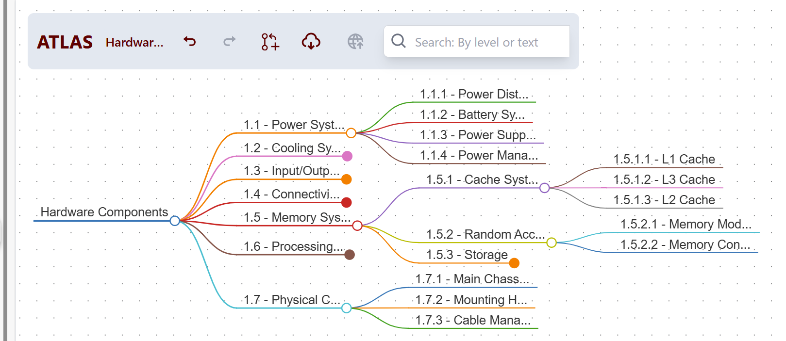

<!-- _class: cool-list -->
- **Structured Visualization & Output**
  - Proposal Generation
  - Project Planning
  - Learning Plans
  - Structured Ideation

  

    

- **User-extensible data model**
  - Object Tagging
  - 3D Graph visualization
  - Quantitative Analysis
  - Budgeting
  - Reporting 

    

        

---
# Technical Strategy

**Challenge**: Hypothesis is weakly supported & difficult to comprehensively test
**Approach**: Iterative, freemium SaaS with 100-500 MAU to prove concept and explore product-market fit

<!-- _class: cool-list -->
- **In development**
  - Minimal open source platform (<$0.20/user-mo)
  - Frictionless, free onboarding
  - Predictable user-extensible data model
  - Robust export (pdf, docx)
  - Broad document support (Quill, LaTeX, UML, Markedjs)

  

    

- **Future**
  - Alternative renderers
  - Unstructured views
  - Reporting API
  - Ingest API
  - AI-driven authoring
  - Cross-structure graph visualization

    

        

---
# Roadmap
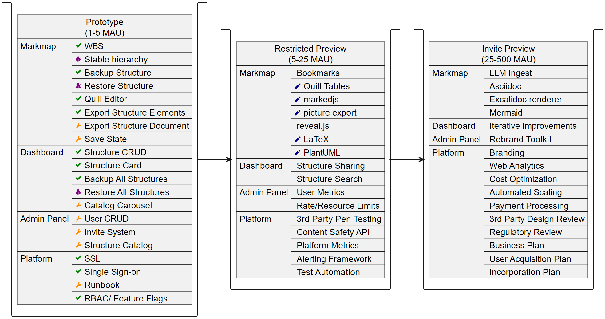

---

# User Acquisition

- Multiple authoring experiences tuned to underserved persona
  - Project Planner*
  - Academic, Specialist
  - Freelance Consultant
- Attract base from whiteboard, notetaking, specialist apps
- Integrate with EPM tools (API/Webhook) for visualization & planning

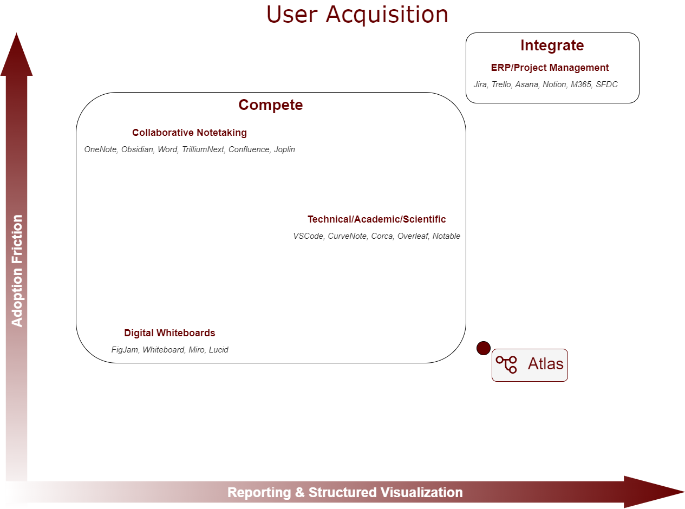

---
# Record Editor Strategy
<b>Mission</b>:  Be useful

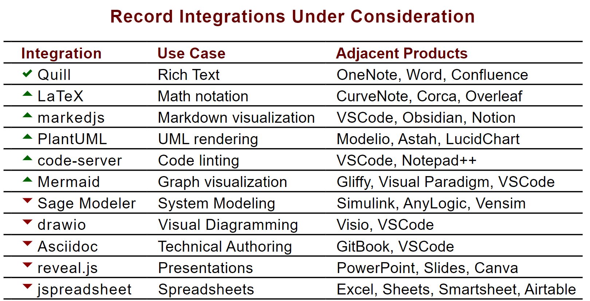

---
# Structure Renderer Options
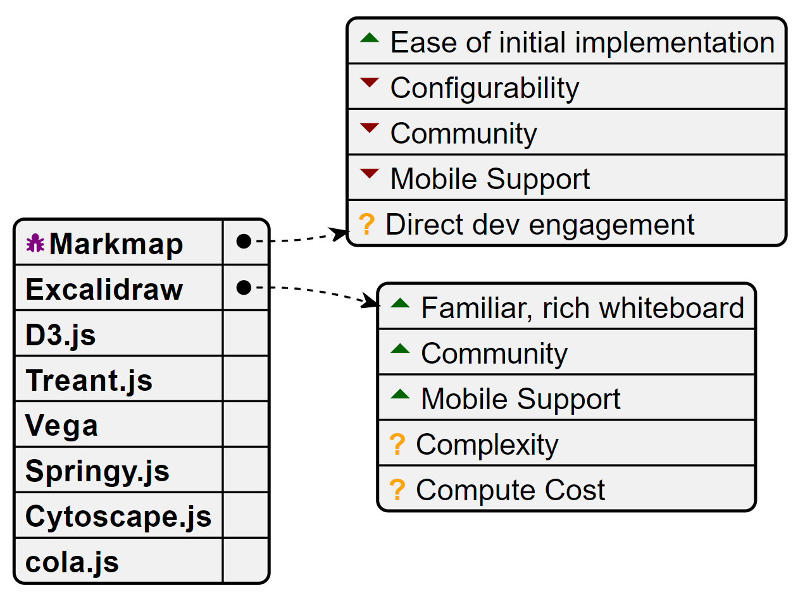

---
# Architecture
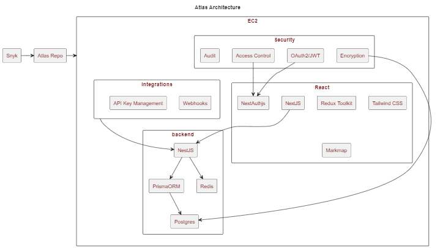

---
# Alternative Approaches

- Plugin:  build a plugin for existing platforms
  - Platform captivity
  - Opaque user patterns
  - Not much less expensive
  - Addressable via ingest API
- Document processor with Wordpress frontend
  - Inelegent and uninformative
  - Opaque user patterns

> Neither leave residual value from a failed experiment

---

# Dev Sprints
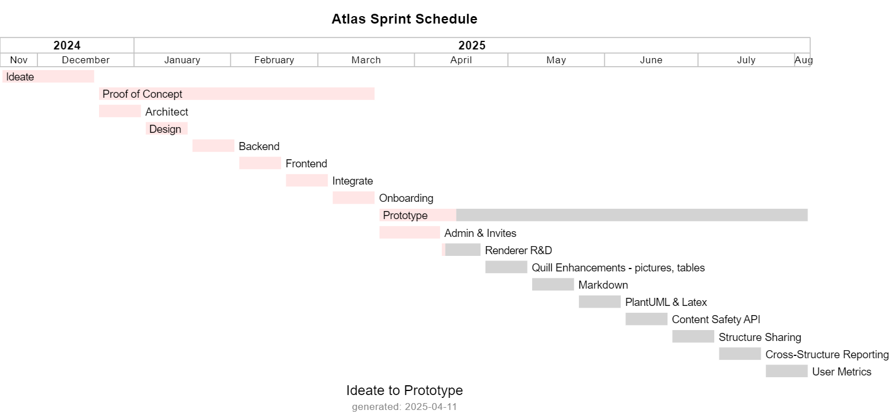

---

# Preview Sprints
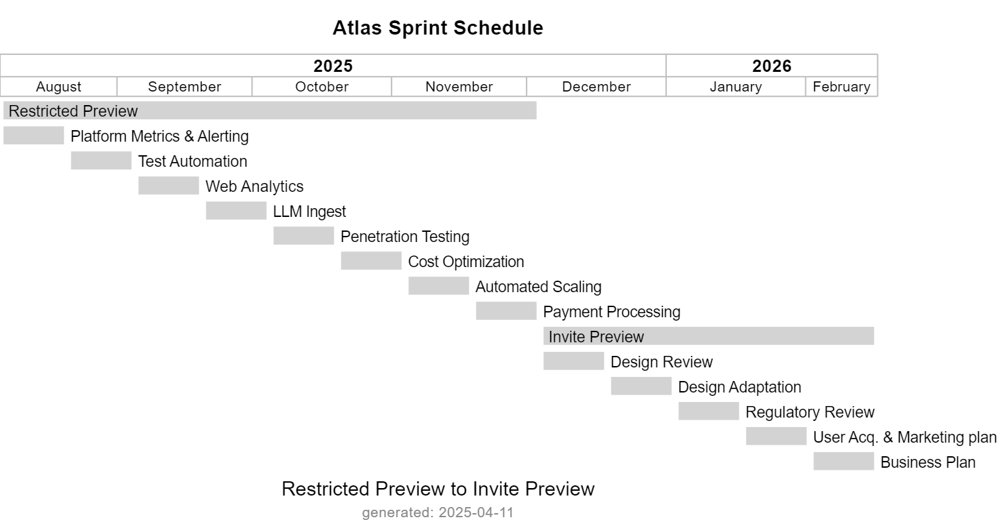

---

<!-- _class: lead --> 
# User Interface

---

# Single Sign-on

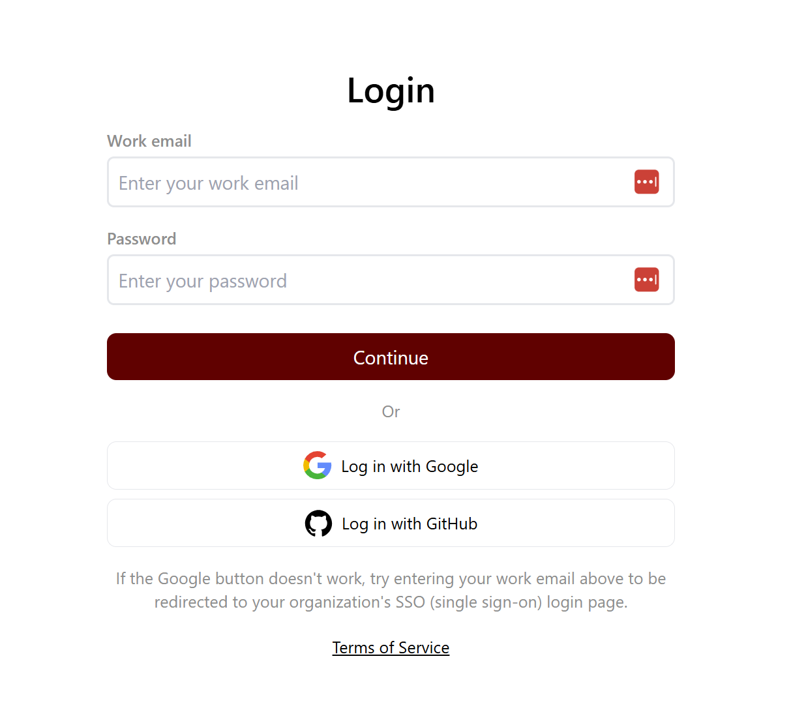

---

# Tiering

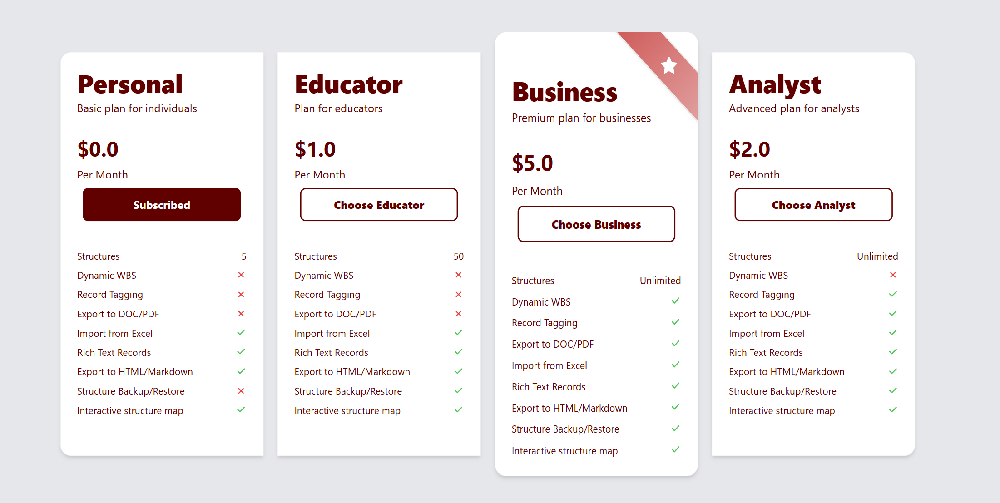

---

# Structure

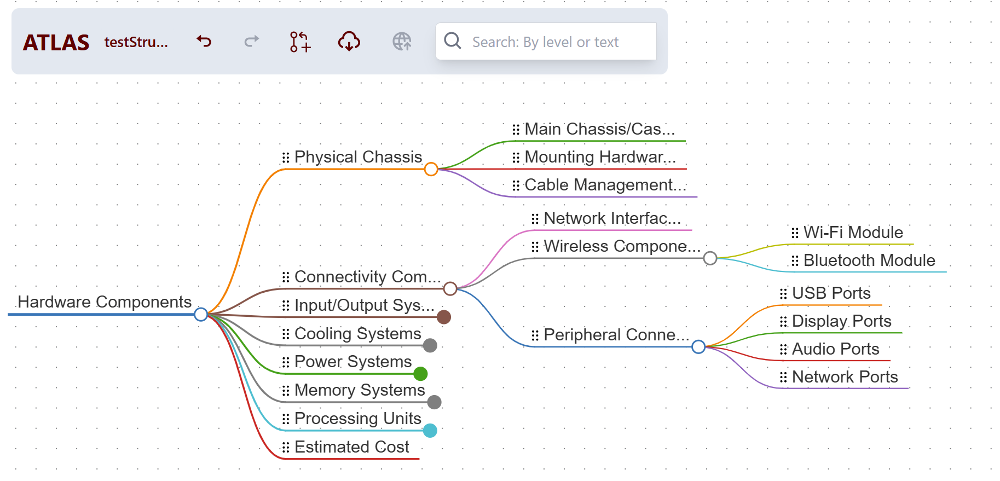

---

# Work Breakdown Numbering

---

# Record Editor, Object Tagging

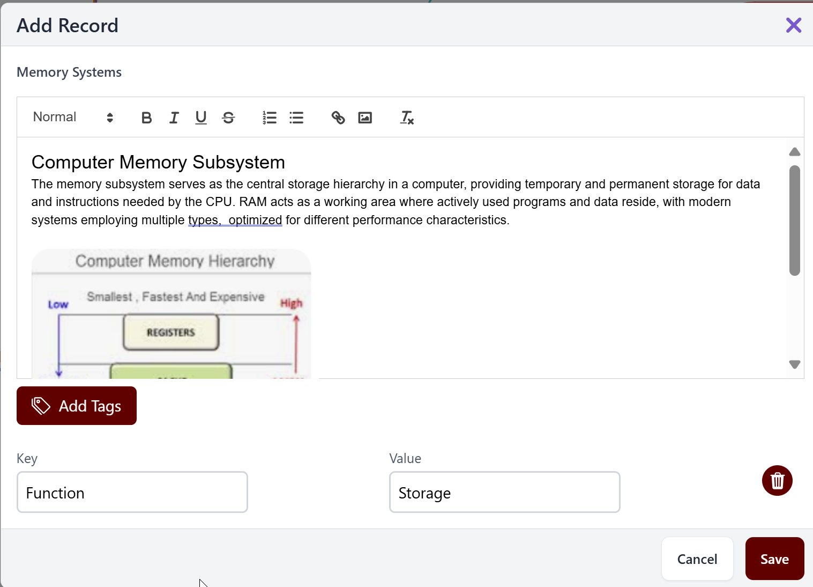

---

# Invite System

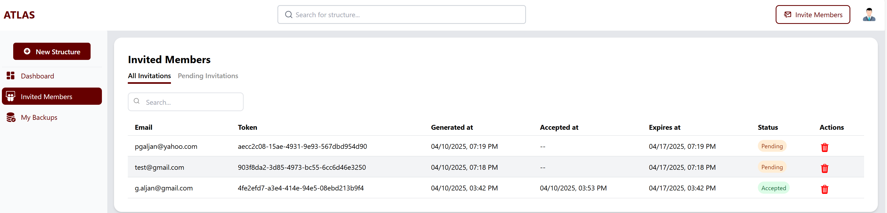

---
# Structure & Account Backups

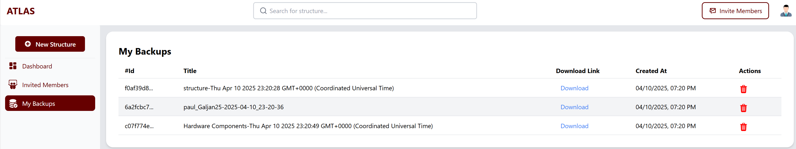

---

<!-- _class: lead --> 
# Administrator Interface

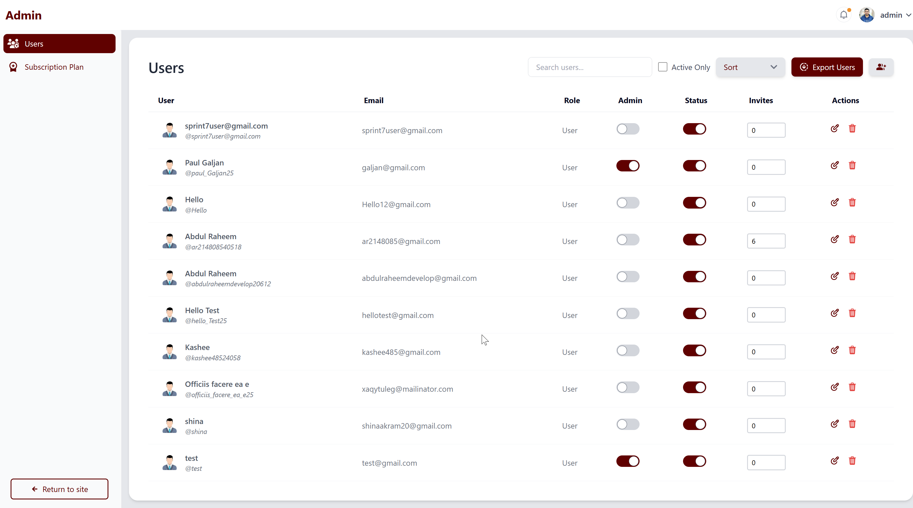

---

# User Admin

---

# Subscription Plan Management

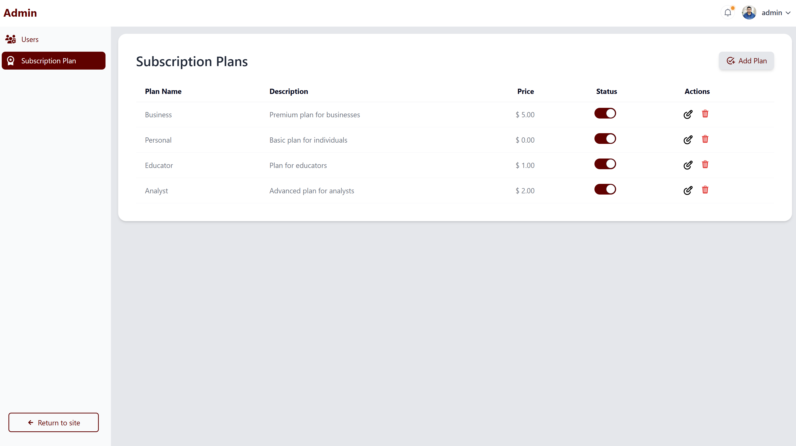

---

# Subscription Plan Authoring

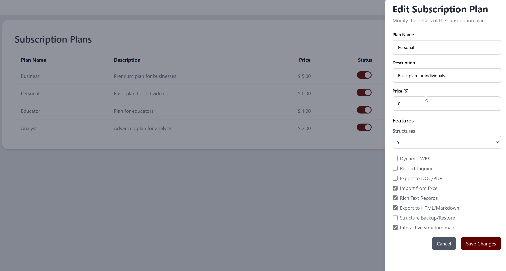

